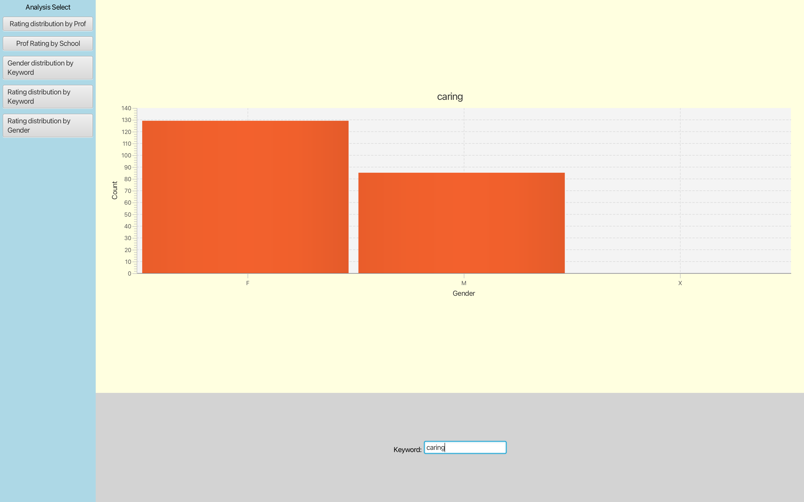

# Rate My Teacher Gender Biased Trends

[Demo Link](https://www.youtube.com/watch?v=q8gdFg1dwMM)

## Description

Teaching evaluations are not an objective evaluation of the quality of a professor’s teaching. Recent research has shown that teaching evaluations often demonstrate harmful biases, including  gender bias. The bias in teaching evaluations is a problem because the scores are often used in decisions about whom to hire, fire, tenure, and promote.

This project allows to visualize the breakdown of word frequencies by numerical rating and professor gender. It pre-process the data depending on the trend we want to analyse. These are the following trends:

- Rating distribution by prof
- Prof rating by school
- Gender distribution by keyword
- Rating distribution by keyword
- Rating distribution by gender

### Dataset
A dataset collected of 19,685 reviews overall from the popular website RateMyProfessors.com, where university students can publish anonymous **textual** reviews of their professors along with **numerical** ratings on both the perceived quality and difficulty of a course.

The CSV formatted datasets contains 8 columns with the following labels:

- professor name: the name of the prof receiving a review.
- school name: the name of the school where the prof is from.
- department name: the department where the prof teaches.
- post date: the date on which the review was posted.
- student star: how the student rated the prof/course in terms of quality.
- student difficult: how the student rated the prof/course in terms of difficulty.
- comments: the comment posted by the student.
- gender: the perceived gender of the prof. (M/F/X)

This dataset is saved optimally in hash tables depending on the trend we want to observe.

## How to Install and Run the Project

### Set Up

In Intellij:

- Windows user:
  - It should be already included in the SDK if you are using Java 1.8 or higher.
- Mac user:
  - By default you laptop might be using Amazom Correto distribution, you need to change it to Liberica distribution to support media.

### Run the Project

Go to `src/finalproject/Main.java` and run it!